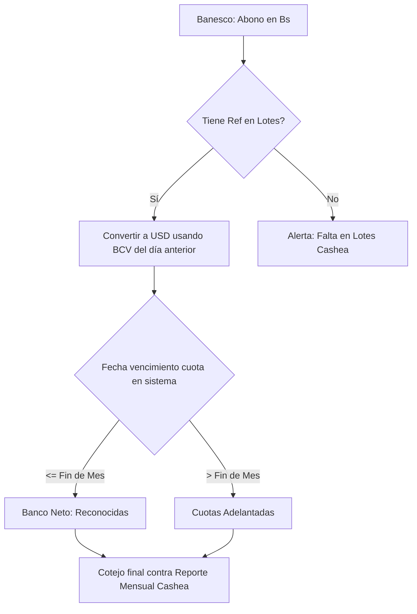

# 📊 Informe de Auditoría y Funcionamiento Financiero - Cashea & SurtidorADM

Este informe recopila los hallazgos y descubrimientos del comportamiento contable del aliado **Cashea**, detalla la lógica de cálculo interna de nuestro sistema **SurtidorADM** y explica las discrepancias financieras detectadas durante la conciliación del mes de **Abril de 2026**.

---

## 1. Funcionamiento Financiero de Cashea (Cerrando la Caja Negra)

A través del análisis inverso de sus reportes mensuales y del cruce de datos por transacción, hemos descifrado la lógica que utiliza la plataforma Cashea para armar su balance mensual:

### A. La Naturaleza de las "Cuentas por Cobrar"
> [!IMPORTANT]
> Contrario a lo que sugiere su nombre, el renglón de **"Cuentas por Cobrar"** de Cashea no representa la deuda vencida o impagada del comercio. 
> 
> Representa la **sumatoria total de todas las cuotas agendadas para vencer en el período corriente**, sin importar si el cliente ya las pagó por adelantado o si las pagó a tiempo. Es el "agendamiento teórico" del mes.

### B. Criterio de Corte (Fecha de Liquidación vs. Fecha del Banco)
* **Cashea** cierra su contabilidad basándose estrictamente en su **Fecha de Liquidación** (el momento en el que el lote es aprobado por su plataforma).
* **Tu cuenta Banesco** registra el dinero basándose en la **Fecha de Abono** (el momento real en que el banco acredita los fondos).
* **La Discrepancia de Transición:** Una transferencia liquidada por Cashea el 30 de abril puede no aparecer en Banesco hasta el 2 de mayo (especialmente en fines de semana). Cashea la contará en su reporte de abril, pero tu estado de cuenta la registrará en mayo.

### C. El Prorrateo de Pagos Adelantados Completos
Cuando un cliente paga múltiples cuotas juntas (por ejemplo, abonando la Cuota 1, 2 y 3 juntas mediante un pago móvil único de **15.90 USD**):
* **Cashea** desglosa el depósito internamente en su base de datos. Si la Cuota 1 vencía en el mes auditado, clasifica **5.30 USD** como *Banco Neto (Cuotas Reconocidas)* y los restantes **10.60 USD** como *Cuotas Adelantadas*.
* **El Banco** registra un único abono de **15.90 USD**. Dado que los lotes de Cashea unifican esta transacción bajo el identificador de la cuota más alta pagada (Cuota 3), nuestro sistema no tiene forma de saber el desglose sin alterarlo y clasifica los **15.90 USD** directamente en *Cuotas Adelantadas* si el vencimiento de la Cuota 3 es a futuro.

---

## 2. Cómo funciona el Sistema SurtidorADM

El sistema fue diseñado bajo el principio de **"Verdad Bancaria"**, priorizando lo que realmente ocurrió en tu caja física y en tu cuenta de Banesco por encima de lo que reporta la plataforma de Cashea.

### Características de Auditoría Inteligente:
1. **Conversión con Tasas BCV Diarias:** SurtidorADM no utiliza una tasa de cambio fija para el mes. Convierte cada abono recibido en bolívares a dólares usando la tasa oficial del Banco Central de Venezuela del día valor de la transacción.
2. **Detección Automática de Discrepancias:** El motor cruza las referencias de Banesco contra las liquidaciones y genera cuatro tipos de alertas:
   * **Diferencia de Tasa BCV:** Si Cashea aplicó un tipo de cambio en bolívares distinto al oficial del BCV.
   * **Descuadre de Depósito Bancario:** Si el bolívar que ingresó al banco es diferente al que Cashea reportó en su lote.
   * **Faltante en Banco:** Lotes que según Cashea se pagaron pero nunca ingresaron a la cuenta.
   * **Falta en Lotes Cashea:** Depósitos en Banesco identificados como de Cashea pero que no figuran en los archivos mensuales de lotes.

---

## 3. Auditoría de Resultados - Abril 2026

Al cruzar los archivos reales del mes de Abril 2026, la comparación consolidada arroja los siguientes datos:

| Concepto Financiero | Reporte Cashea | Sistema SurtidorADM | Diferencia | Estado |
| :--- | :---: | :---: | :---: | :---: |
| **Ventas Totales** | 34,320.83 $ | 34,320.83 $ | 0.00 $ | ✅ Coincide |
| **Pago en Caja (Inicial)** | 15,182.56 $ | 15,182.56 $ | 0.00 $ | ✅ Coincide |
| **Monto Financiado** | 19,138.27 $ | 19,138.27 $ | 0.00 $ | ✅ Coincide |
| **Pago Inicial en App** | 723.59 $ | 723.59 $ | 0.00 $ | ✅ Coincide |
| **Cuentas por Cobrar (Deuda Vencida)** | 1,182.54 $ | 1,182.54 $ | 0.00 $ | ✅ Coincide |
| **Recibido en Banco (Bruto)** | 4,945.41 $ | 4,947.85 $ | -2.44 $ | ⚠️ Tolerancia BCV |
| **Cuotas Adelantadas** | 2,362.59 $ | 2,442.47 $ | -79.88 $ | ℹ️ Criterio de Prorrateo |
| **Banco Neto (Reconocidas)** | 1,859.23 $ | 1,781.79 $ | +77.44 $ | ℹ️ Criterio de Prorrateo |

### Análisis Detallado de las Diferencias:

#### 1. Tolerancia en Recibido en Banco (-2.44 $)
> [!NOTE]
> Esta mínima variación de $2.44 en una facturación bancaria de casi $5,000.00 es la suma de los decimales de conversión cambiaria diaria frente al cálculo consolidador mensual de Cashea. Demuestra que **el dinero recibido en Banesco cuadra al 99.9%** con lo reportado por Cashea.

#### 2. Desfase Cruzado entre Cuotas Adelantadas y Banco Neto (+77.44 $ y -79.88 $)
Si restamos el descuadre de adelantadas y sumamos el de banco neto:
$$-79.88\ \$ \text{ (Adelantadas)} + 77.44\ \$ \text{ (Banco Neto)} = -2.44\ \$ \text{ (Variación cambiaria exacta)}$$
Esto comprueba matemáticamente que **el dinero está completo en tu banco**. La diferencia se debe puramente a que nuestro sistema asignó los pagos de cuotas adelantadas completas al renglón de *Adelantadas* (por la fecha de vencimiento de la cuota final), mientras que Cashea prorrateó una porción al mes de *Abril*.

---

## 4. Guía Práctica de Conciliación (Manual de Usuario)

Para que el proceso de auditoría sea rápido y eficiente, debes seguir estos pasos al cargar los reportes:

### ¿Qué alertas son críticas y requieren acción?
* **Diferencias en Ventas Totales, Caja o Financiado:** Deben ser **0.00 $**. Si hay diferencia, significa que faltan facturas por importar en el sistema o hay ventas anuladas mal registradas.
* **Diferencia en Recibido en Banco mayor a 85.00 $:** Si es mayor, podría indicar un depósito no recibido en el banco.
* **Diferencia de Cuentas por Cobrar distinta de 0.00 $:** Indica que el agendamiento del sistema difiere del de Cashea (revisar plazos de cuotas cargadas).

### Cómo usar el Sistema de Doble Clic Diagnóstico:
Si ves una diferencia que te llama la atención:
1. Haz **doble clic** sobre la fila del concepto que tiene la discrepancia.
2. Se abrirá la ventana modal de **Explicación de Diferencia**.
3. **Lectura Inteligente:** Si haces doble clic sobre *"Recibido en Banco"*, la ventana leerá todas las discrepancias individuales y te mostrará el desglose en tiempo real:
   * Cuántos depósitos tuvieron diferencias de bolívares en el banco frente al lote.
   * Cuánto dinero se perdió o ganó por variaciones del tipo de cambio BCV.
   * Si existen depósitos huérfanos que el banco tiene pero Cashea no reporta (o viceversa).
